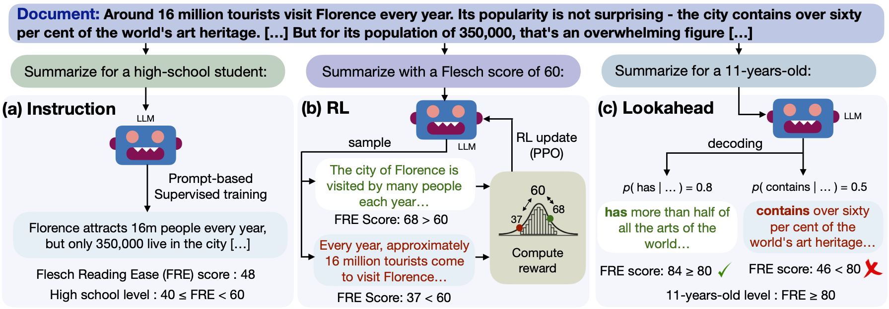

# Generating Summaries with Controllable Readability Levels (EMNLP 2023)

This repository contains the code for the paper "[Generating Summaries with Controllable Readability Levels](https://arxiv.org/pdf/2310.10623)". 

We developed three text generation techniques for controlling readability:

<p align="center">

</p>

(a) illustrates the approach to control the summary readability via fine-grained instructions. (b) shows the RL method where given an input document and the readability level, the policy generates a summary to be scored by our Gaussian-based reward, and (c) shows the lookahead approach which uses a readability score of a future summary to guide the generation.
 
## Environment

The easiest way to proceed is to create a conda environment:
```
conda create -n readability_summ python=3.7
conda activate readability_summ
```

Further, install PyTorch:

```
conda install pytorch torchvision torchaudio cpuonly -c pytorch
```

Install the packages required:
```
pip install -r requirements.txt
```

Install trlx (for the RL method):
```
git clone https://github.com/CarperAI/trlx.git
cd trlx
pip install torch --extra-index-url https://download.pytorch.org/whl/cu118
pip install -e .
```


## Preprocess data

For computing the readability scores for CNN/DM, execute:

```
cd src/preprocess
python preprocess_cnndm.py
```

Generate the prompts:
```
python generate_prompts_category.py
python generate_prompts_score.py
```


## Training

Execute the following commands for training for the prompt-based methods:
```
cd src/train
./train_cnndm.sh
```

For the RL method, execute:
```
cd src/train/rl
./train_rl_cnndm.sh
```

## Inference

For inference, run:
```
cd inference/
./inference_score.sh <checkpoint_folder>
./inference_category.sh <checkpoint_folder>
```

For lookahead inference, run:
```
./inference_lookahead.sh <checkpoint_folder>
```

## Security

See [CONTRIBUTING](CONTRIBUTING.md#security-issue-notifications) for more information.

## License Summary

The documentation is made available under the CC-BY-NC-4.0 License. See the LICENSE file.

## Citation

```
@inproceedings{ribeiro-etal-2023-generating,
    title = "Generating Summaries with Controllable Readability Levels",
    author = "Ribeiro, Leonardo F. R.  and
      Bansal, Mohit  and
      Dreyer, Markus",
    editor = "Bouamor, Houda  and
      Pino, Juan  and
      Bali, Kalika",
    booktitle = "Proceedings of the 2023 Conference on Empirical Methods in Natural Language Processing",
    month = dec,
    year = "2023",
    address = "Singapore",
    publisher = "Association for Computational Linguistics",
    url = "https://aclanthology.org/2023.emnlp-main.714",
    doi = "10.18653/v1/2023.emnlp-main.714",
    pages = "11669--11687",
    abstract = "Readability refers to how easily a reader can understand a written text. Several factors affect the readability level, such as the complexity of the text, its subject matter, and the reader{'}s background knowledge. Generating summaries based on different readability levels is critical for enabling knowledge consumption by diverse audiences. However, current text generation approaches lack refined control, resulting in texts that are not customized to readers{'} proficiency levels. In this work, we bridge this gap and study techniques to generate summaries at specified readability levels. Unlike previous methods that focus on a specific readability level (e.g., lay summarization), we generate summaries with fine-grained control over their readability. We develop three text generation techniques for controlling readability: (1) instruction-based readability control, (2) reinforcement learning to minimize the gap between requested and observed readability and (3) a decoding approach that uses lookahead to estimate the readability of upcoming decoding steps. We show that our generation methods significantly improve readability control on news summarization (CNN/DM dataset), as measured by various readability metrics and human judgement, establishing strong baselines for controllable readability in summarization.",
}

```
